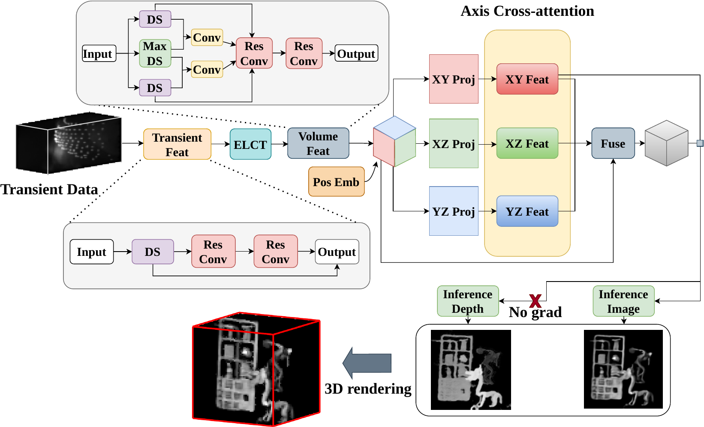
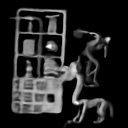
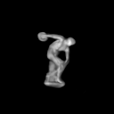
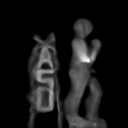
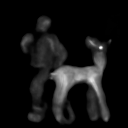

# TRiNLoS

TRiNLoS reconstructs hidden scenes from transient measurements captured on a relay wall. The physics-based module **ELCT** provides a reliable initialization, and a **tri-planar** feature representation reduces complexity from O(N³) to O(N²), enabling efficient joint prediction of an **intensity image** and **depth map** of the hidden scene.

### Pipeline

<p align="center">
  
</p>

---

## Reconstruction Results

<table width="100%" cellpadding="0" cellspacing="0"><tr>
<td width="14%"></td>
<td width="14%"></td>
<td width="14%"></td>
<td width="14%"></td>
<td width="14%"></td>
<td width="15%"></td>
<td width="15%"></td>
</tr></table>

---

## Getting Started

### Installation

```bash
pip install -r requirements.txt
```

### Pretrained Model

Download the pretrained weights and dataset from [here](https://www.dropbox.com/) and place the model state at `checkpoint/model_state.pth`.

---

## Data
Download the pretrained dataset from [here](https://www.dropbox.com/).

Synthetic transients are rendered using the [LFE](https://github.com/princeton-computational-imaging/NLOSFeatureEmbeddings) renderer. The released dataset includes processed data derived from the unseen split of [NLOST](https://github.com/Depth2World/NLOST), together with our generated data. 

Real-world captures can be downloaded from [NLOST](https://github.com/Depth2World/NLOST) and [FK](https://github.com/computational-imaging/nlos-fk).

### Directory layout

```
data/
  train/
    0/
      video-confocal-gray-full.mp4
      confocal.hdr
      dep.hdr
  seen/
  unseen/
  real_data/
    scene1.mat
```

Each scene folder contains one `.mp4` transient video, `confocal.hdr`, and `dep.hdr`. Real measurements are `.mat` files with a `final_meas` or `data` key.

### Preprocessing

```bash
python dataset/dataprovider.py --data-root data --output-dir dataset
```

---

## Training

```bash
python train.py
# or with custom config
python train.py --config path/to/config.yaml
```

---

## Evaluation

```bash
python validate.py \
  --val-data dataset/seen.pth dataset/unseen.pth \
  --val-names seen unseen \
  --model-state-pth checkpoint/model_state.pth
```

---

## Inference on Real Data

```bash
# Full pipeline (intensity + depth)
python infer_real.py \
  --real-data data/real_data \
  --checkpoint checkpoint/model_state.pth \
  --output-dir output/real_data

# ELCT reconstruction
python infer_real_elct.py \
  --real-data data/real_data \
  --output-dir output/real_data_elct
```

---

## Citation

```bibtex
@inproceedings{trinlos2026,
  title     = {TriNLOS: Triplane Representations for Neural Non-Line-of-Sight Imaging},
  booktitle = {European Conference on Computer Vision (ECCV)},
  year      = {2026},
}
```
